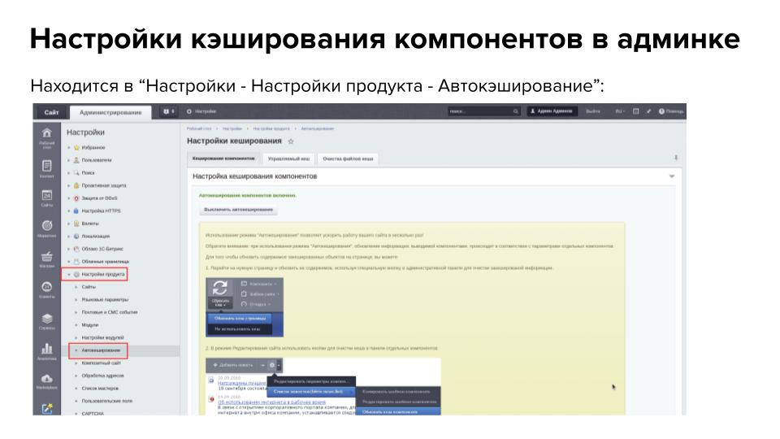

# Курсовая работа "Среда разработки и конфигурация"

* [Цели проекта](#цели-проекта)
* [Чеклист готовности к работе над проектом](#Чеклист-готовности-к-работе-над-проектом)
* [Описание проекта](#Описание-проекта)
* [Сроки реализации проекта](#Сроки-реализации-проекта)
* [Инструкция к выполнению](#Инструкция-к-выполнению)
    * [1 этап](#1-этап)
    * [2 этап](#2-этап)
    * [3 этап](#3-этап)
    * [4 этап](#4-этап)
    * [5 этап](#5-этап)
* [Правила сдачи проекта](#Правила-сдачи-проекта)
* [Критерии оценки](#критерии-оценки)

### Цель

Цель командного проекта - разработка информационного сайта на CMS Битрикс.  

Вам предстоит:
- Самостоятельно разработать и настроить разделы "Новости", "Статьи", "Документы"
- Настроить управление сайтом через административную панель, встроенную в публичную часть сайта
- Настроить отображение новостей по таймеру

Также на сайте должны быть реализованы:

- Дополнительная веб-форма (обратная связь/заказ обратного звонка)
- Страница 404
- 1 обработчик событий 
- ЧПУ раздела
- 1 собственный компонент

В результате выполнения командного проекта вы:
- получите практический опыт работы в команде
- прокачаете навыки коммуникации и умение выполнять задачи в срок
- закрепите навыки работы с GitHub
- потренируете навык проверки кода и совместной разработки.

В команде вы отработаете навык разработки сайта, навык работы с Git и проведение кода ревью друг друга.
Командная работа над проектом позволит отточить hard- и soft skills и повысит вашу конкурентоспособность на рынке.

### Чеклист готовности к работе над проектом

- [x] Изучили "Инструкцию по выполнению командного проекта" и "Правила работы в команде" в личном кабинете
- [x] Знаете, кто с вами в команде
- [x] Познакомились с игроками команды и определились, каким способом будете общаться (переписка в любом мессенджере, видеозвонки)
- [x] Договорились, кто будет размещать общий репозиторий проекта и отправлять его на проверку

У вас должен быть установлен …… 
Установлен git и создан аккаунт на Github.

### Инструменты/ дополнительные материалы, которые пригодятся для выполнения задания

### Описание задачи

Разработать информационный сайт на CMS Битрикс в команде по три человека. 
Легенда…..

### Требования к результату

   
 
Каждый игрок команды выполняет свою часть работы, указанный раздел сайта:

Первый игрок - раздел “Новости”
Второй - раздел ”Статьи”
Третий - раздел “Документы”

Время:
20 часов (2 недели по 2 часа)

### Сроки реализации проекта
Работа над проектом рассчитана на 14 дней для команды из трех человек. 

Для планирования своего времени рекомендуется опираться на роадмап. 
Придерживайтесь следующего деления проекта на этапы и задачи участников:

|Этапы|Кол-во дней|Задачи|
|-----|------|----------|
|1, 2 этапы|1 день|Создание репозитория для проекта, предоставление доступа участникам, распределение задач|
|3 этап|3 дня|Разработка разделов|
|4 этап|3 дня|Взаимопроверка, устранение ошибок|
|Сдача проекта|3 дня|Отправка, анализ обратной связи от проверяющего преподавателя|
|Доработка по результатам* (при необходимости)||2 дня|Доработка проекта по итогам обратной связи от проверяющего|
|Повторная сдача проекта* (при необходимости)|3 дня|Отправка, обратная связь от проверяющего преподавателя|

### Инструкция к выполнению

1 этап. Создание общего репозитория
Один из участников создаёт у себя репозиторий и размещает в него содержимое этого репозитория (не через Fork), настраивает CI.
Для предоставления доступа второму участнику необходимо зайти в Settings репозитория проекта, найти раздел Collaborators, кликнуть по кнопке Add people, добавить ник напарника и выбрать роль Admin.

2 этап. Распределение задач
Распределите задачи между участниками в соответствии с таблицей.

### Правила приема работы

   

### Критерии оценки

|Номер|Пример|Коментарии|
|-----|------|----------|
|1|Пример 1|Разработать|
|2|Пример 2|**Проработать**|
|3| Пример 3|Создать|
|4|Пример 4|**Алгоритм**|
|5|Пример 5|`$uniqId = 'my-id'`|

